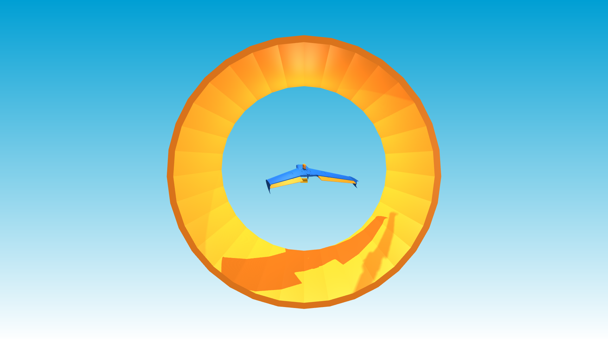
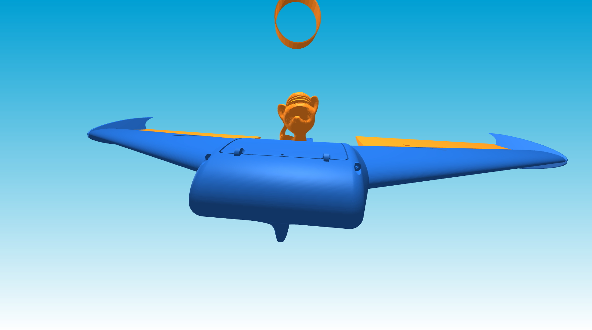
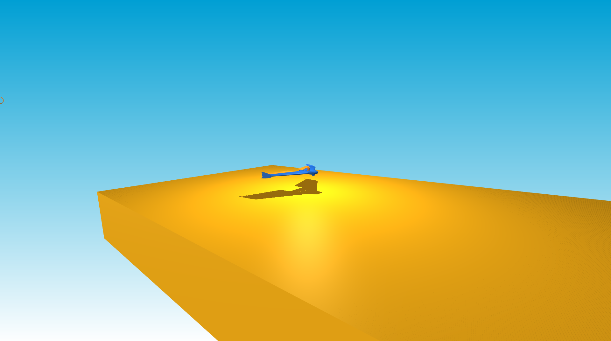
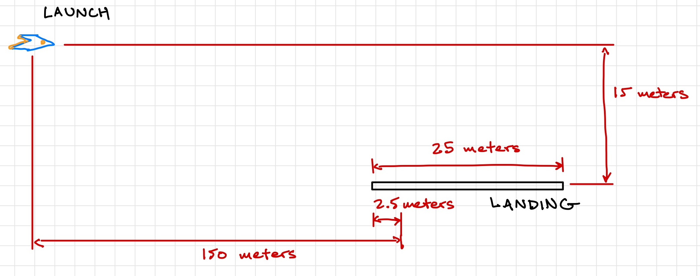

# Design Project 2 (flying wing)
{: .no_toc }

- TOC
{:toc }

## System

The second project that you will complete this semester is to design, implement, and test a controller that enables a fixed-wing aircraft --- in particular, a glider that resembles the "Zagi" flying wing --- to land safely on a floating runway with its test-pilot (a cat).

---


The aircraft being launched.

---


The pilot of the aircraft.

---


The aircraft landing on a floating runway.

---

A [flying wing](https://en.wikipedia.org/wiki/Flying_wing) is an aircraft without a tail. In principle, this design has the advantage that it eliminates a major source of drag and so can be an excellent unpowered glider. It has a long history in the aviation industry (e.g., see [The development of the flying wing (Schwader, 1997)](https://doi.org/10.58940/2329-258X.1212) or [Jack Northrop and the flying wing (Correll, 2017)](https://www.airandspaceforces.com/PDF/MagazineArchive/Documents/2017/February%202017/0217northrop.pdf)) and also has been popular among RC pilots and hobbyists (e.g., see [The Zagi (MESA RC, 2014)](https://www.flitetest.com/articles/the-zagi) or [Zagi 400 and 400X (K0LEE)](https://k0lee.com/zagi.php)).

One disadvantage of the flying wing is that it can be harder to control. Right and left "elevons" replace the rudder, elevator, and ailerons as control surfaces. If both elevons move up or down, they act like an elevator. If elevons move in opposite directions, they act like ailerons. Your job is to design an autopilot that handles this additional complexity.

Cats have, yet again, been hired as test-pilots. Keep them safe!


## Model

The motion of the aircraft is governed by ordinary differential equations with the following form:

$$
\begin{align*}
\begin{bmatrix} \dot{p}_x \\ \dot{p}_y \\ \dot{p}_z \end{bmatrix}
&= R^W_B(\psi, \theta, \phi) \begin{bmatrix} v_x \\ v_y \\ v_z \end{bmatrix} \\
\begin{bmatrix} \dot{\psi} \\ \dot{\theta} \\ \dot{\phi} \end{bmatrix}
&= N(\psi, \theta, \phi) \begin{bmatrix} w_x \\ w_y \\ w_z \end{bmatrix} \\
\begin{bmatrix} \dot{v}_x \\ \dot{v}_y \\ \dot{v}_z \end{bmatrix}
&= \dfrac{1}{m} \left(
  \begin{bmatrix}
    f_x(v_x, v_y, v_z, w_x, w_y, w_z, \delta_r, \delta_l) \\
    f_y(v_x, v_y, v_z, w_x, w_y, w_z, \delta_r, \delta_l) \\
    f_z(v_x, v_y, v_z, w_x, w_y, w_z, \delta_r, \delta_l)
  \end{bmatrix}
  -
  \begin{bmatrix} w_x \\ w_y \\ w_z \end{bmatrix}
  \times m \begin{bmatrix} v_x \\ v_y \\ v_z \end{bmatrix}
\right) \\
\begin{bmatrix} \dot{w}_x \\ \dot{w}_y \\ \dot{w}_z \end{bmatrix}
&= {J^B}^{-1} \left(
  \begin{bmatrix}
    \tau_x(v_x, v_y, v_z, w_x, w_y, w_z, \delta_r, \delta_l) \\
    \tau_y(v_x, v_y, v_z, w_x, w_y, w_z, \delta_r, \delta_l) \\
    \tau_z(v_x, v_y, v_z, w_x, w_y, w_z, \delta_r, \delta_l)
  \end{bmatrix}
  -
  \begin{bmatrix} w_x \\ w_y \\ w_z \end{bmatrix}
  \times J^B \begin{bmatrix} w_x \\ w_y \\ w_z \end{bmatrix}
\right).
\end{align*}
$$

The variables in these equations are defined as follows:

* $p_x, p_y, p_z$ are the components of position expressed in the world frame ($\text{m}$);
* $\psi, \theta, \phi$ are the yaw, pitch, and roll angles ($\text{rad}$);
* $v_x, v_y, v_z$ are the components of linear velocity expressed in the body frame ($\text{m}/\text{s}$);
* $w_x, w_y, w_z$ are the components of angular velocity expressed in the body frame ($\text{rad}/\text{s}$);
* $\delta_r, \delta_l$ are the right and left elevon deflection angles ($\text{rad}$) --- positive means the elevons rotate down.

{: .warning}
> Both the world and body frames have $x$ forward, $y$ right, and $z$ down (in the same direction as gravity), a common convention with aircraft. So, when the aircraft descends, $p_z$ gets bigger.

The constant parameters in these equations are defined as follows:

* $m$ is the mass ($\text{kg}$);
* $J^B$ is the moment of inertia matrix expressed in the body frame ($\text{kg}\cdot\text{m}^2$).

The functions in these equations are defined as follows:

* $R^W_B$ is the rotation matrix that describes the orientation of the body frame in the coordinates of the world frame;
* $N$ is the transformation matrix that converts angular velocity to angular rates;
* $f_x, f_y, f_z$ and $\tau_x, \tau_y, \tau_z$ are the aerodynamic forces and torques, respectively --- they are primarily functions of airspeed, angle of attack, angle of sideslip, and elevon deflection angles, but also have some dependence on angular velocity.

These functions, particularly the ones that compute aerodynamic forces and torques, are complicated enough that we will not present the details here.

{: .note-title}
> Aerodynamic coefficients
>
> Aerodynamic coefficients were taken from the [first edition](https://press.princeton.edu/books/hardcover/9780691149219/small-unmanned-aircraft) of [Small Unmanned Aircraft: Theory and Practice (Beard and McLain, 2012)](https://github.com/byu-magicc/mavsim_public). The authors acknowledge that "[there are some issues with the Zagi coefficients given in the textbook](https://github.com/byu-magicc/mavsim_public?tab=readme-ov-file#comments)," which come from [Integration of an autopilot for a micro air vehicle (Platanitis and Shkarayev, 2005)](https://ntrs.nasa.gov/citations/20050185598). So, I used ChatGPT to correct these coefficients, with the following prompt:
>
> > Here is a python dictionary with aerodynamic coefficients and other parameters that describe a zagi UAV.
> > ```
> > params = {
> >   ...
> > }
> > ```
> > I think some of these parameters are incorrect. Please fix them. Give me a python dictionary that has corrected values for the same set of parameters. Please do not change the mass or the wingspan. Please add a comment to each line of the dictionary that gives the name and a brief description of each parameter, along with its units.
>
> I checked the result against other sources, for example [Design and Trim Optimization of a Flying Wing UAV (Quindlen, 2010)](https://honors.libraries.psu.edu/catalog/1320). Most of the corrected values were consistent with these other sources.
>
> In some cases, I had to give additional prompts. For example, I asked for a value that had been forgotten:
> 
> > You forgot to include rho, which was in the original dictionary.
>
> Similarly, I asked for another look at certain coefficients that seemed inconsistent with other sources:
>
> > Are you sure about C_L_q? That seems high.
>
> Perhaps the most important difference between the original coefficients (and aerodynamic model) and the final coefficients was to use a quadratic model rather than a linear model for drag as a function of elevon deflection angle.
>
> It is clear that the coefficients I am using do not correspond to any real aircraft, although they are similar to coefficients that *would* correspond to a real aircraft of similar design. A better model is a nice contribution that could be made by interested students or instructors in future.
>
> One final thing to note is that the aerodynamic model in the simulator is different from the aerodynamic model provided in the equations of motion for the purpose of control design --- the model in the simulator includes stall, while the model in the equations of motion does not.

Sensors provide measurements of position, orientation, linear velocity, and angular velocity. Actuators allow you to choose the right and left elevon deflection angles, up to a maximum of $\pm 0.5\;\text{rad}$ (slightly less than $30^\circ$).



The aircraft is launched $15\;\text{m}$ above and $150\;\text{m}$ in front of the runway, as shown in the schematic above. More precisely,

$$p_x = 0 \qquad p_y = 0 \qquad p_z = 0$$

at the point of launch and

$$p_x = 150 \qquad p_y = 0 \qquad p_z = 15$$

at the (nominal) point of landing. The runway is $5\;\text{m}$ wide and $25\;\text{m}$ long. The initial airspeed at launch is sampled uniformly in the range $[4.5, 5.5]\;\text{m}/\text{s}$. The yaw, pitch, and roll angles at launch are sampled uniformly in the range $[-\pi / 6, \pi / 6]\;\text{rad}$. All other initial conditions are zero.

The code provided [here]({{ site.github.repository_url }}/tree/main/projects/02_zagi) simulates the motion of this system ([ZagiDemo]({{ site.github.repository_url }}/blob/main/projects/02_zagi/ZagiDemo-Template.ipynb)) and also derives the equations of motion in symbolic form ([DeriveEOM]({{ site.github.repository_url }}/blob/main/projects/02_zagi/DeriveEOM-Template.ipynb)).

## Tasks

Please do the following things:

* Choose an equilibrium point (ofen called a "trim condition" in the context of flight control) that corresponds to whatever glide path you think will result in a safe landing.
* Linearize the equations of motion about this equilibrium point.
* Show that the linearized system is controllable.
* Design a stable controller.
* Implement this controller and test it in simulation.

{: .warning-title}
> A warning about equilibrium points
>
> When you try to linearize the full set of equations of motion, you will likely find that there exists no equilibrium point. Which states will you have to remove from these equations of motion in order for an equilibrium point to exist?
>
> Similarly, you may be unable to compute an equilibrium point by hand. Is there a way to compute one numerically?

In doing these things, **keep your focus on the safety of your pilots**.

Would you feel comfortable asking a cat-pilot to land your aircraft based on evidence from only one simulation (starting from only one set of initial conditions) that your controller "works"?

Would you feel comfortable asking other cats --- those who are not test-pilots --- to land your aircraft based on the success of only one simulation?

Think carefully about what results would support a comprehensive argument for the safety of your autopilot and --- since no control system is 100% reliable --- try hard to identify the conditions under which failures are likely to occur.

{: .note-title}
> Requirements and verifications
>
> In this project, we would like you to be more specific about what you mean by "success" and to provide **quantitative** evidence supporting the claim that you have (or have not) succeeded. People often think about this in terms of **requirements** and **verifications**.
> 
> We expect that you have already had some experience with requirements and verifications from AE 100 and AE 202. Here is a reminder of what these things are.
>
> A **requirement** is a property that the system you are designing must have in order to solve your problem (i.e., a thing that needs to get done). A good requirement is quantifiable --- it involves a number that must be within a certain range in order to solve your design problem. A good requirement is also both relevant (it *must* be satisfied --- it is not optional) and detailed (it can be read and understood by anyone).
>
> A **verification** is a test that you will perform to make sure that the system you are designing meets a given requirement. A good verification is based on a measurement --- it checks that a quantity is in the range specified by the requirement. A good verification also has a set of instructions for how to make the measurement (an experimental protocol) and for how to interpret the results (methods of data analysis and visualization that provide evidence the requirement has been met).
>
> We strongly encourage you to define a requirement (a quantitative measure of success) and verification (a test to verify that this measure has been achieved) for yourself and present it in your report. Doing so will make your report easier to understand. We also believe it will make your work more efficient --- requirements and verifications make it very clear what your goals are and what it means to be "done."


## Deliverables

### Draft report with theory (by 11:59pm on Friday, February 28) {#first-draft}

Submit a first draft of your [report (see below for guidelines)](#final-report). This draft must include a complete *Theory* section, which is what we will focus on in our review. This draft must also include the *Abstract*, *Nomenclature*, and *Introduction*.

Upload it to the [**DP2 Draft 1** group assignment on Canvas](https://canvas.illinois.edu/courses/54818/assignments/1225806).


### Draft report with results (by 11:59pm on Friday, March 7) {#second-draft}

Submit a second draft of your [report (see below for guidelines)](#final-report). This draft must include a complete *Experimental methods* section and a complete *Results and discussion* section, which are what we will focus on in our review. This draft must also include the *Conclusion*, *Appendix*, *Acknowledgements*, and *References*.

Upload it to the [**DP2 Draft 2** group assignment on Canvas](https://canvas.illinois.edu/courses/54818/assignments/1225807).


### Final report (by 11:59pm on Friday, March 14) {#final-report}

This report will satisfy the following requirements:

* It must be a single PDF document that conforms to the guidelines for [Preparation of Papers for AIAA Technical Conferences](https://www.aiaa.org/events-learning/events/Technical-Presenter-Resources). In particular, you **must** use either the [Word](https://www.aiaa.org/docs/default-source/uploadedfiles/aiaa-forums-shared-universal-content/preparation-of-papers-for-technical-conferences.docx?sfvrsn=e9a97512_10) or [LaTeX](https://www.overleaf.com/latex/templates/latex-template-for-the-preparation-of-papers-for-aiaa-technical-conferences/rsssbwthkptn#.WbgUXMiGNPZ) manuscript template.
* It must have a descriptive title that begins with "DP2" (e.g., "DP2: Control of a fixed-wing glider").
* It must have a list of author names and affiliations.
* It must contain the following sections:
  * *Abstract.* Summarize your entire report in one short paragraph.
  * *Nomenclature.* List all symbols used in your report, with units.
  * *Introduction.* Prepare the reader to understand the rest of your report and how it fits within a broader context.
  * *Theory.* Derive a model and do control design.
  * *Experimental methods.* Describe the experiments you performed in simulation in enough detail that they could be understood and repeated by a colleague.
  * *Results and discussion.* Show the results of your experiments in simulation (e.g., with plots and tables) and discuss the extent to which they validate your control design and support an argument for the safety of your landing system.
  * *Conclusion.* Summarize key conclusions and identify ways that others could improve or build upon your work.
  * *Appendix.* Provide a review of your landing system from the perspective of one or more of your cat-pilots. They are important stakeholders. (How did they feel during approach? Were they involved in any accidents? Do they have concerns about safety? Etc.) You are welcome to refer to this appendix --- i.e., to the remarks from your cat-pilots --- in other parts of your report, if it is helpful in supporting your arguments.
  * *Acknowledgements.* Thank anyone outside your group with whom you discussed this project and clearly describe what you are thanking them for.
  * *References.* Cite any sources, including the work of your colleagues.
* It must contain a URL (with hyperlink) to your [final video](#final-video).
* It must be a maximum of 6 pages.

Submit your report by uploading it to the [**DP2 Report** group assignment on Canvas](https://canvas.illinois.edu/courses/54818/assignments/1225809).

### Final video (by 11:59pm on Friday, March 14) {#final-video}

This video will satisfy the following requirements:

* It must be 60 seconds in length.
* The first and last 5 seconds must include text with a descriptive title (the same title as your report), your names, and the following words somewhere in some order:
  * AE353: Aerospace Control Systems
  * Spring 2025
  * Department of Aerospace Engineering
  * University of Illinois at Urbana-Champaign
* The middle 50 seconds must communicate the highlights of your methods and results to potential stakeholders. Who are you designing for? How will your controller help them?
* It must show at least one simulation of your working control system.
* It must include at least one remark from a cat-pilot.
* It must be engaging (have fun with this).
* It must not be offensive --- use common sense and ask if you are uncertain.

Submit your video by uploading it to the [AE353 (Spring 2025) Project Videos](https://mediaspace.illinois.edu/channel/channelid/369105032) channel on Illinois Media Space. Please take care to do the following:

* Use the same descriptive title as your report, appended with your names in parentheses --- for example, "DP2: Control of a fixed-wing glider (Tim Bretl and Jacob Kraft)".
* Add the tag `dp2` (a **lower case** "dp" followed by the number "2"), so viewers can filter by project number.
* Ask someone else to confirm that they can view the video on Media Space (i.e., that it has, indeed, been published to the correct channel).

You are welcome to resubmit your video at any time before the deadline. To do so, please "Edit" your **existing** video and then do "Replace Media". Please do **not** create a whole new submission.

We realize that 60 seconds is short! Think carefully about what to include (what to show and what to say) and anticipate the need for multiple "takes" and for time spent editing.

Please also submit the URL for your video to the [**DP2 Video** group assignment on Canvas](https://canvas.illinois.edu/courses/54818/assignments/1225810). You can find this URL by viewing your video on Media Space and then by clicking "Share" and "Link to Media Page".


### Final code (by 11:59pm on Friday, March 14)

This code will satisfy the following requirements:

* It must be a single jupyter notebook (with the extension `.ipynb`) that, if placed in the `projects/02_zagi` directory and run from start to finish, would reproduce *all* of the results that you show in your report.
* It must not rely on any dependencies other than those associated with the [`ae353` conda environment](../setup).
* It must be organized and clearly documented, with a mix of markdown cells and inline comments.

Submit your code by uploading it to the [**DP2 Code** group assignment on Canvas](https://canvas.illinois.edu/courses/54818/assignments/1225805). You will be asked to upload it in two formats — as the original `.ipynb` (so we can run your code) and as rendered `.html` (so we can see and comment on your code in Canvas). Follow [these instructions](https://code.visualstudio.com/docs/datascience/jupyter-notebooks#_export-your-jupyter-notebook) to get your notebook in `.html` format.


### Individual reflection (by 11:59pm on Monday, March 24)

Complete the [**DP2 Reflection** assignment on Canvas](https://canvas.illinois.edu/courses/54818/assignments/1225808) sometime between 11:00am on Friday, March 14 and 11:59pm on Monday, March 24. This assignment, which should take no more than 10 or 15 minutes, will give you a chance to reflect on your experiences during this project and to identify things you may want to change for the next project.


## Evaluation

Your project grade will be weighted as follows:

* (10%) Draft report with theory
* (10%) Draft report with results
* (40%) Final report
* (20%) Final video
* (10%) Final code
* (10%) Individual reflection

Rubrics will be discussed in class.
