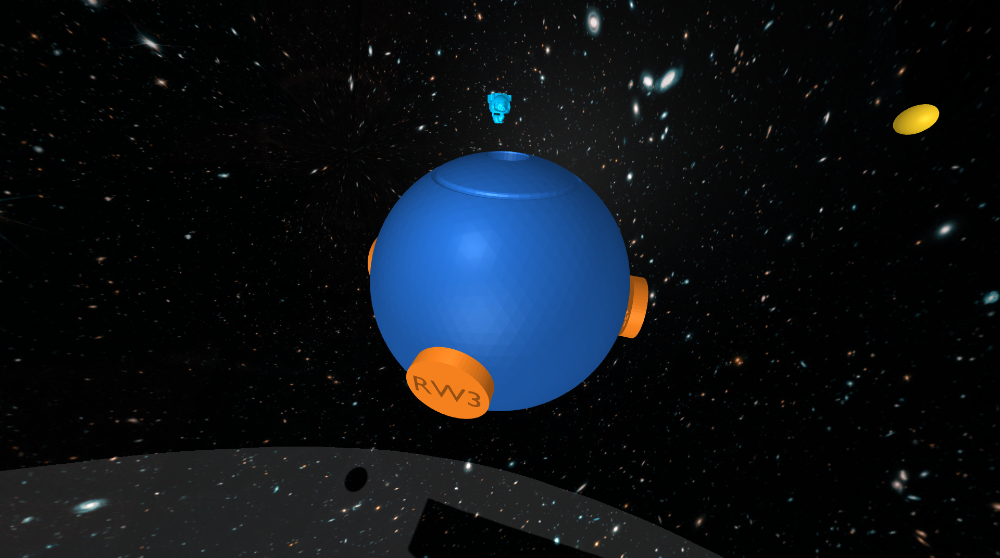
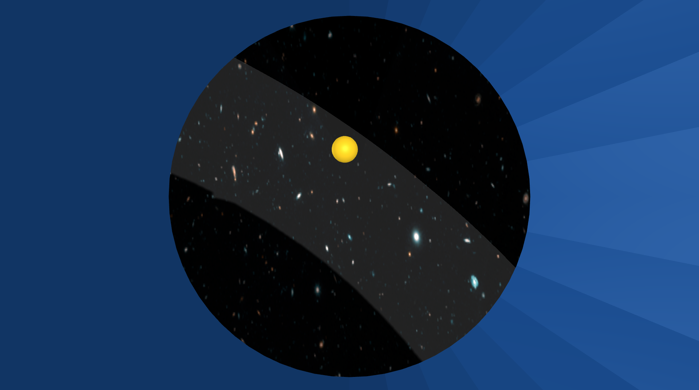
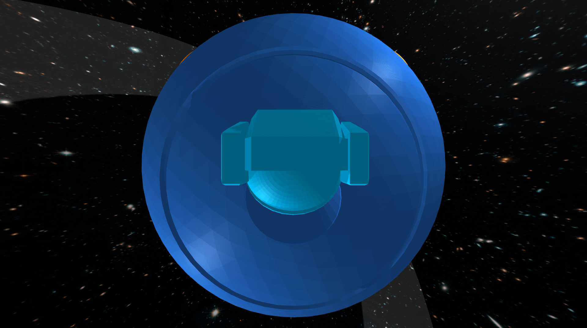

# Design Project 3 (spacecraft with star tracker)
{: .no_toc }

- TOC
{:toc }

## System

The third project that you will complete this semester is to design, implement, and test a controller that enables a spacecraft to maintain a fixed orientation so that an astronaut (i.e., a space cat) can safely dock and re-enter the spacecraft through a hatch.

---

The spacecraft.

---

The view from the star tracker.

---

The space-cat waiting to dock through the hatch.

---

This spacecraft (dark blue) has four reaction wheels (orange). It is up to you to decide where these reaction wheels are located — the picture shows one among many possibilities. These reaction wheels are momentum exchange devices — when a torque is applied to a wheel, an equal and opposite torque is applied to the spacecraft. It is these reaction wheels that will allow your controller to keep the spacecraft pointing in the right direction.

This spacecraft also has a star tracker. This star tracker is a camera that measures the position in an image of each star (yellow) in its field of view. These measured positions, while not perfect, can be compared to where stars *should* be in order to estimate the orientation and angular velocity of the spacecraft. It is up to you to decide which stars to track — that is, to decide both how many stars to track and also where these stars *should* be located in the field of view of the star tracker.

Beware! Flying debris (red) may collide with your spacecraft and cause sudden disturbances.

An astronaut (light blue), who has been conducting operations outside the spacecraft, is almost out of air and so is on their way back to dock and re-enter through a small hatch. Unfortunately, this astronaut is also completely out of fuel, and so is unable to change either their speed or direction of motion. For this reason, it is absolutely critical that the spacecraft maintain a fixed orientation (despite the flying debris) — otherwise, the astronaut will miss the hatch and a brave cat will have been lost.

Bring your astronaut home!

## Context {#spacecraft-context}

[Celestial navigation](https://education.nationalgeographic.org/resource/navigation/) — "using stars, moon, sun, and horizon to calculate position" (or simply the time of day) — dates back thousands of years.

[Star trackers](https://en.wikipedia.org/wiki/Star_tracker) — like those from [Ball](https://www.ball.com/aerospace/capabilities/technologies-components/star-trackers), [Terma](https://www.terma.com/products/space/star-trackers/), or [Rocket Lab](https://www.rocketlabusa.com/space-systems/satellite-components/star-trackers/), for example — take this same concept into space. One key difference is that while celestial navigation on Earth has been used primarily to determine position (i.e., latitude and longitude), star trackers in space are used primarily to determine orientation or "spacecraft attitude."

The way this works is that star trackers compare the location of stars in an image to a pre-surveyed catalog of stars. In particular, this catalog allows a star tracker to predict the pattern of stars that will be seen in an image as a function of spacecraft orientation. The star tracker searches for the orientation — e.g., for the yaw, pitch, and roll angles — that would make the predicted pattern best match the observed pattern.

Doing this from scratch without a good initial guess is a challenge, and can be slow. *Updating* an *existing* estimate of orientation, however, can be done quickly and used for fine guidance. This is what you will do in your own project.

Some of the small satellites that are designed, built, and launched by the Laboratory for Advanced Space Systems at Illinois (LASSI) use star trackers as a critical part of their GNC subsystems. See their [description of facilities](https://aerospace.illinois.edu/research/research-facilities/laboratory-advanced-space-systems-illinois-lassi) and [ research website](https://lassiaero.web.illinois.edu) for more information.

You can read more about star trackers and their use for spacecraft attitude determination — as well as more about reaction wheels and their use for spacecraft attitude control — in [Fundamentals of Spacecraft Attitude Determination and Control (Markley and Crassidis, 2014)](https://link.springer.com/book/10.1007/978-1-4939-0802-8).

## Model

The rotational motion of the spacecraft is governed by ordinary differential equations with the following form:

$$\begin{bmatrix} \dot{\psi} \\ \dot{\theta} \\ \dot{\phi} \\ \dot{w_x} \\ \dot{w_y} \\ \dot{w_z} \end{bmatrix} = f\left(\psi, \theta, \phi, w_x, w_y, w_z, \tau_1, \tau_2, \tau_3, \tau_4\right).$$

Here are the variables in these equations:

* $\psi$ is the **yaw angle** (rad)
* $\theta$ is the **pitch angle** (rad)
* $\phi$ is the **roll angle** (rad)
* $w_x$ is the **angular velocity about the body-fixed $x$ axis** (rad/s), which points forward
* $w_y$ is the **angular velocity about the body-fixed $y$ axis** (rad/s), which points left
* $w_z$ is the **angular velocity about the body-fixed $z$ axis** (rad/s), which points up
* $\tau_1$ is the **torque applied to wheel 1** by a motor on the spacecraft ($N\cdot\text{m}$)
* $\tau_2$ is the **torque applied to wheel 2** by a motor on the spacecraft ($N\cdot\text{m}$)
* $\tau_3$ is the **torque applied to wheel 3** by a motor on the spacecraft ($N\cdot\text{m}$)
* $\tau_4$ is the **torque applied to wheel 4** by a motor on the spacecraft ($N\cdot\text{m}$).

{: .warning}
> The body frame attached to the spacecraft has $x$ forward, $y$ **left**, and $z$ **up**. This convention is different from what is commonly used for aircraft (with $y$ right and $z$ down), and in particular is different from what you used in your [second design project](02-zagi). A positive yaw angle means the spacecraft rotates **left** (not right, like the aircraft). A positive pitch angle means the spacecraft rotates **down** (not up, like the aircraft).

The maximum torque that can be applied by each motor is $\pm 2\;\text{N}\cdot\text{m}$.

A [symbolic description of these equations of motion]({{ site.github.repository_url }}/tree/main/projects/03_spacecraft/DeriveEOM-Template.ipynb) is provided with the [project code]({{ site.github.repository_url }}/tree/main/projects/03_spacecraft).

{: .note-title}
> You must choose the placement of reaction wheels
>
> **The dynamic model depends on where the reaction wheels are placed.** The [same notebook that derives the equations of motion]({{ site.github.repository_url }}/tree/main/projects/03_spacecraft/DeriveEOM-Template.ipynb) also allows you to choose (and visualize) this placement. You **must** run the code in this notebook **before** you run the simulator, since it creates the file (`spacecraft.urdf` in the `urdf` directory) that has a model of the spacecraft with **your** choice of reaction wheel locations.

The sensor is a star tracker. It measures the position (in an image) of each star in its field of view. This measurement has the following form **for each star**:

$$\begin{bmatrix} y_\text{star} \\ z_\text{star} \end{bmatrix} = g(\psi, \theta, \phi, \alpha, \delta).$$

You will already recognize the yaw, pitch, and roll angles in this equation. The other variables are as follows:

* $\alpha$ is the **right ascension** (rad) of the star
* $\delta$ is the **declination** (rad) of the star.

Again, a [symbolic description of this equation]({{ site.github.repository_url }}/tree/main/projects/03_spacecraft/DeriveEOM-Template.ipynb) is provided with the [project code]({{ site.github.repository_url }}/tree/main/projects/03_spacecraft).

{: .note-title}
> You must choose the number and location of stars
>
> **The sensor model depends on how many stars there are and on where they are located.** The [same notebook that derives the measurement equations]({{ site.github.repository_url }}/tree/main/projects/03_spacecraft/DeriveEOM-Template.ipynb) also allows you to choose (and visualize) the number and location of stars. You **must** run the code in this notebook **before** you run the simulator, since it creates the file (`stars.json` in the `urdf` directory) that has a model of the stars with **your** choice of number and location.

The code provided [here]({{ site.github.repository_url }}/tree/main/projects/03_spacecraft) simulates the motion of this system ([SpacecraftDemo]({{ site.github.repository_url }}/tree/main/projects/03_spacecraft/SpacecraftDemo-Template.ipynb)) and also derives both the equations of motion and the sensor model in symbolic form ([DeriveEOM]({{ site.github.repository_url }}/tree/main/projects/03_spacecraft/DeriveEOM-Template.ipynb)).

The simulator will quit and the spacecraft mission will be declared over when one of two conditions are met:

* Any star leaves the star tracker's field of view.
* Any reaction wheel has angular velocity that exceeds $\pm 50\;\text{rad}/\text{s}$.

The goal is to avoid these two conditions and to keep the spacecraft close to zero yaw, pitch, and roll for at least as long as it takes the astronaut to dock and re-enter (sixty seconds), despite noisy sensor measuremens and space debris.

## Tasks

Please do the following things:

* Choose the placement of reaction wheels.
* Choose the number and location of stars.
* Linearize the dynamic model (i.e., the equations of motion) and the sensor model (i.e., the measurement equations) about some choice of equilibrium point.
* Show that the linearized system is both controllable and observable.
* Design a stable controller and a stable observer.
* Implement both the controller and observer and test them in simulation.

Just as in your [second design project](02-zagi#tasks), you must be specific about what you mean by "success" and you must provide **quantitative** evidence to support the claim that you have (or have not) succeeded. Remember that people often think about this in terms of **requirements** and **verifications**.

{: .note-title}
> Aggregate results
>
> In this project, we would like you to focus on data collection. The initial conditions, the sensor measurements, and the disturbances are random. So, for a given control design, your results will vary (perhaps significantly). It is not enough to look at the results of one simulation — you will have to look at the results of many simulations.
>
> At minimum, for the **final** design you consider, we expect you to collect data from at least 100 simulations that run either until the astronaut has docked or until failure. We also expect you to **visualize** these aggregate results. Histograms (e.g., of time until failure or of root-mean-square-error) are something you might consider, for example, but there are many other options — be creative.
> 
> Remember that the simulation code provides an option to turn the display off, which can speed up data collection a lot.

{: .note-title}
> Two different types of error
>
> In your first two projects, the only type of error you measured was the difference $x = m - m_e$ (or perhaps $x - x_\text{des}$) between the state and its desired value. This type of error is often called **error in the state**.
>
> Now, you have a new type of error to consider — the difference $\hat{x} - x$ between the state estimate and the state. This type of error is often called **error in the state estimate**.
>
> It is important to understand the following four things:
> * "Error in the state" and "error in the state estimate" are different — do not mix them up.
> * The purpose of an observer is to make error in the state estimate small.
> * The purpose of a controller is to make error in the state small.
> * In general, the observer must be working well (i.e., error in the state estimate must be small) in order for the controller to work well — tune your observer first.
>
> In order to show that **both** your controller and observer are working, you must show that **both** types of error get small.

In doing these things, **keep your focus on the safety and well-being of your astronaut**. They need to know not only that your control system is reliable, but also what failures are possible and how likely they are to occur.

## Deliverables

### Draft report with theory (by 11:59pm on Friday, March 28) {#first-draft}

Submit a first draft of your [report (see below for guidelines)](#final-report). This draft must include a complete *Theory* section, which is what we will focus on in our review. This draft must also include the *Abstract*, *Nomenclature*, and *Introduction*.

Upload it to the [**DP3 Draft 1** group assignment on Canvas](https://canvas.illinois.edu/courses/54818/assignments/1225812).

### Draft report with results (by 11:59pm on Friday, April 4) {#second-draft}

Submit a second draft of your [report (see below for guidelines)](#final-report). This draft must include a complete *Experimental methods* section and a complete *Results and discussion* section, which are what we will focus on in our review. This draft must also include the *Conclusion*, *Appendix*, *Acknowledgements*, and *References*.

Upload it to the [**DP3 Draft 2** group assignment on Canvas](https://canvas.illinois.edu/courses/54818/assignments/1225813).

### Final report (by 11:59pm on Friday, April 11) {#final-report}

This report will satisfy the following requirements:

* It must be a single PDF document that conforms to the guidelines for [Preparation of Papers for AIAA Technical Conferences](https://www.aiaa.org/events-learning/events/Technical-Presenter-Resources). In particular, you **must** use either the [Word](https://www.aiaa.org/docs/default-source/uploadedfiles/aiaa-forums-shared-universal-content/preparation-of-papers-for-technical-conferences.docx?sfvrsn=e9a97512_10) or [LaTeX](https://www.overleaf.com/latex/templates/latex-template-for-the-preparation-of-papers-for-aiaa-technical-conferences/rsssbwthkptn#.WbgUXMiGNPZ) manuscript template.
* It must have a descriptive title that begins with "DP3" (e.g., "DP2: Control of a spacecraft with a star tracker").
* It must have a list of author names and affiliations.
* It must contain the following sections:
  * *Abstract.* Summarize your entire report in one short paragraph.
  * *Nomenclature.* List all symbols used in your report, with units.
  * *Introduction.* Prepare the reader to understand the rest of your report and how it fits within a broader context.
  * *Theory.* Derive a model and do control design.
  * *Experimental methods.* Describe the experiments you performed in simulation in enough detail that they could be understood and repeated by a colleague.
  * *Results and discussion.* Show the results of your experiments in simulation (e.g., with plots and tables) and discuss the extent to which they validate your control design and support an argument for the safety of your docking system.
  * *Conclusion.* Summarize key conclusions and identify ways that others could improve or build upon your work.
  * *Appendix.* Provide a review of your docking system from the perspective of one or more of your cat-pilots (i.e., astronauts). They are important stakeholders. You are welcome to refer to this appendix — i.e., to the remarks from your cat-pilots — in other parts of your report, if it is helpful in supporting your arguments.
  * *Acknowledgements.* Thank anyone outside your group with whom you discussed this project and clearly describe what you are thanking them for.
  * *References.* Cite any sources, including the work of your colleagues.
* It must contain a URL (with hyperlink) to your [final video](#final-video).
* It must be a maximum of 6 pages.

Submit your report by uploading it to the [**DP3 Report** group assignment on Canvas](https://canvas.illinois.edu/courses/54818/assignments/1225815).

### Final video (by 11:59pm on Friday, April 11) {#final-video}

This video will satisfy the following requirements:

* It must be 60 seconds in length.
* The first and last 5 seconds must include text with a descriptive title (the same title as your report), your names, and the following words somewhere in some order:
  * AE353: Aerospace Control Systems
  * Spring 2025
  * Department of Aerospace Engineering
  * University of Illinois at Urbana-Champaign
* The middle 50 seconds must communicate the highlights of your methods and results to potential stakeholders. Who are you designing for? How will your controller help them?
* It must show at least one simulation of your working control system.
* It must include at least one remark from a cat-pilot.
* It must be engaging (have fun with this).
* It must not be offensive --- use common sense and ask if you are uncertain.

Submit your video by uploading it to the [AE353 (Spring 2025) Project Videos](https://mediaspace.illinois.edu/channel/channelid/369105032) channel on Illinois Media Space. Please take care to do the following:

* Use the same descriptive title as your report, appended with your names in parentheses --- for example, "DP3: Control of a spacecraft with a star tracker (Tim Bretl and Jacob Kraft)".
* Add the tag `dp3` (a **lower case** "dp" followed by the number "3"), so viewers can filter by project number.
* Ask someone else to confirm that they can view the video on Media Space (i.e., that it has, indeed, been published to the correct channel).

You are welcome to resubmit your video at any time before the deadline. To do so, please "Edit" your **existing** video and then do "Replace Media". Please do **not** create a whole new submission.

We realize that 60 seconds is short! Think carefully about what to include (what to show and what to say) and anticipate the need for multiple "takes" and for time spent editing.

Please also submit the URL for your video to the [**DP3 Video** group assignment on Canvas](https://canvas.illinois.edu/courses/54818/assignments/1225816). You can find this URL by viewing your video on Media Space and then by clicking "Share" and "Link to Media Page".

### Final code (by 11:59pm on Friday, April 11)

This code will satisfy the following requirements:

* It must be a single jupyter notebook (with the extension `.ipynb`) that, if placed in the `projects/03_spacecraft` directory and run from start to finish, would reproduce *all* of the results that you show in your report.
* It must not rely on any dependencies other than those associated with the [`ae353` conda environment](../setup).
* It must be organized and clearly documented, with a mix of markdown cells and inline comments.

Submit your code by uploading it to the [**DP3 Code** group assignment on Canvas](https://canvas.illinois.edu/courses/54818/assignments/1225811). You will be asked to upload it in two formats — as the original `.ipynb` (so we can run your code) and as rendered `.html` (so we can see and comment on your code in Canvas). Follow [these instructions](https://code.visualstudio.com/docs/datascience/jupyter-notebooks#_export-your-jupyter-notebook) to get your notebook in `.html` format.

### Individual reflection (by 11:59pm on Monday, April 14)

Complete the [**DP3 Reflection** assignment on Canvas](https://canvas.illinois.edu/courses/54818/assignments/1225814) sometime between 11:00am on Friday, April 11 and 11:59pm on Monday, April 14. This assignment, which should take no more than 10 or 15 minutes, will give you a chance to reflect on your experiences during this project and to identify things you may want to change for the next project.

## Evaluation

Your project grade will be weighted as follows:

* (10%) Draft report with theory
* (10%) Draft report with results
* (40%) Final report
* (20%) Final video
* (10%) Final code
* (10%) Individual reflection

Rubrics will be discussed in class.
